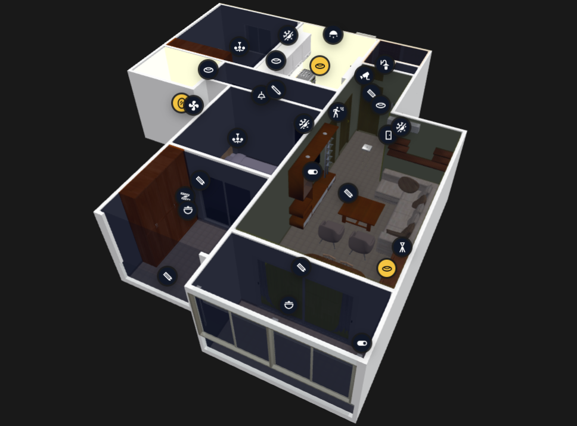

# Home Assistant 3D Floorplan



A Lovelace custom card for placing Home Assistant entities directly on a 3D model. The active workflow is 3D-only: load a `.glb`, switch to Edit Mode, select an entity from the sidebar, then click the model to save the marker at the clicked 3D coordinate.

The active card is `custom:home-assistant-3d-floorplan`.

## Install

Add this JavaScript resource in Home Assistant:

```yaml
url: /local/Home-Assistant-3D-Floorplan.js
type: module
```

If installed through HACS, use:

```yaml
url: /hacsfiles/Home-Assistant-3D-Floorplan/Home-Assistant-3D-Floorplan.js
type: module
```

## Basic Card

```yaml
type: custom:home-assistant-3d-floorplan
title: 3D Floorplan
model: /local/floorplans/home.glb
view_mode: "3d"
markers: []
```

Marker colors show live state by default:

- Red: unavailable or unknown
- Yellow: active/on/open/detected
- Dark: inactive/off/closed/clear
- Green: available neutral state

Marker press actions default to:

```yaml
marker_tap_action: auto
marker_hold_action: auto
edit_marker_tap_action: select
edit_marker_hold_action: move
marker_hold_ms: 650
```

`auto` uses domain defaults: lights and switches toggle on tap, while sensors, binary sensors, and climate entities open more-info. Holds open more-info unless overridden. Edit Mode is shown only when Home Assistant reports `hass.user.is_admin === true`. In Edit Mode, placed markers expose Tap and Hold controls so a marker can save its own actions:

```yaml
tap_action: more-info
hold_action: more-info
```

The default coordinate labels are tuned for the Sweet Home 3D to Blender GLB flow:

```yaml
coordinate_map:
  x: z
  y: x
  z: y
vertical_axis: z
```

So the displayed `X` and `Z` are swapped from the previous mapping, while displayed `Z` remains the vertical axis label used by the card controls.

Use `.glb` or `.gltf` when possible. Basic `.obj` files can load, but `.glb` is usually better because it can carry geometry, materials, and textures in one browser-friendly file.

## Editing Markers

1. Open the card in Home Assistant.
2. Press **Edit Mode**.
3. Select an entity from the sidebar.
4. Click the exact point on the 3D model where the marker should sit.
5. Open **Export YAML** and press **Copy YAML** to copy the current marker coordinates into your dashboard/card configuration.

The YAML export updates automatically after marker placement, moves, coordinate edits, icon changes, and action changes. Browser storage is device-local; paste the exported markers into the card YAML when you want the same layout on every phone, tablet, and browser.

Markers are stored as real model coordinates:

```yaml
markers:
  - entity: light.kitchen
    name: Kitchen Light
    icon: mdi:lightbulb
    tap_action: toggle
    hold_action: more-info
    light_intensity: 100
    x: 1.2400
    y: 0.8500
    z: -3.4200
```

## Brightness Areas

Edit Mode can define room brightness areas. Press **Add Area**, then **Draw**, and click the room corners on the 3D model. Any placed `light.*` marker inside that polygon contributes to the area's glow: off lights add no glow, lights without a brightness attribute count as fully on, and dimmable lights use their `brightness` value multiplied by the marker's `light_intensity` percentage.

Brightness areas export with the card YAML:

```yaml
brightness_zones:
  - id: kids-room
    name: Kids Room
    color: "#f8d66d"
    height: 0.8500
    points:
      - x: 1.2400
        y: -3.4200
      - x: 4.1000
        y: -3.4200
      - x: 4.1000
        y: -6.2000
```

Ambient darkness is dynamic by default. The card reads `sun.sun`: during the day unlit areas are only lightly shaded, and at night unlit areas get stronger wall/floor shading plus a mid-height shade above furniture. You can tune or disable it:

```yaml
ambient_darkness:
  entity: sun.sun
  day_opacity: 0.50
  night_opacity: 1.00
```

## Multiple Floors Or Models

```yaml
type: custom:home-assistant-3d-floorplan
title: Home Floorplan
view_mode: "3d"
floors:
  - id: ground
    name: Ground Floor
    model: /local/floorplans/ground-floor.glb
    markers: []
  - id: first
    name: First Floor
    model: /local/floorplans/first-floor.glb
    markers: []
```

## Three.js URLs

The card loads Three.js modules dynamically. Some mobile WebViews, including the Home Assistant Companion App on iPadOS, can block or fail remote module imports. If the model works on desktop but the Companion App says the 3D model could not be loaded, host these files locally under `www/vendor/three/` and point the card at them:

```yaml
three_url: /local/vendor/three/three.module.js
gltf_loader_url: /local/vendor/three/GLTFLoader.js
obj_loader_url: /local/vendor/three/OBJLoader.js
orbit_controls_url: /local/vendor/three/OrbitControls.js
```

Use matching files from the same Three.js release as the defaults, `0.165.0`.
